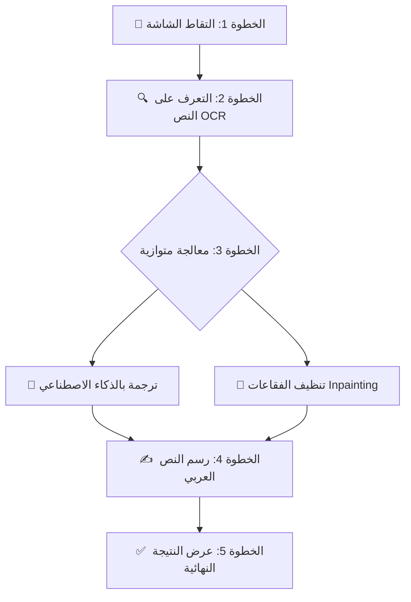

# خط أنابيب الترجمة في MangaLens (Translation Pipeline)

هذا تحليل كامل لكل خطوة يتبعها التطبيق لترجمة صفحة مانغا/مانهوا/مانها من لغتها الأصلية إلى العربية.

---

## المخطط العام



---

## الخطوة 1: التقاط الشاشة (Screenshot Capture) — `10%`

**الملف:** [browser_provider.dart](file:///d:/MangaLens/lib/features/browser/providers/browser_provider.dart)

- عندما يضغط المستخدم على زر الترجمة (FAB)، يقوم المتصفح المدمج (`InAppWebView`) بالتقاط لقطة شاشة (Screenshot) لصفحة المانغا الحالية.
- يتم تحويل اللقطة إلى `Uint8List` (مصفوفة بايتات الصورة) وتمريرها للخطوة التالية.

---

## الخطوة 2: التعرف على النص — OCR (Text Recognition) — `30%`

**الملف:** [ocr_service.dart](file:///d:/MangaLens/lib/features/ocr/data/ocr_service.dart)

هذه هي الخطوة الأذكى. يتم استخدام **Google ML Kit** مباشرة على الجهاز (بدون إنترنت) مع **4 محركات** تعمل بالتوازي:

| المحرك | اللغة | الاستخدام |
|---|---|---|
| `_japaneseRecognizer` | 🇯🇵 اليابانية | المانغا |
| `_koreanRecognizer` | 🇰🇷 الكورية | المانهوا |
| `_chineseRecognizer` | 🇨🇳 الصينية | المانها |
| `_latinRecognizer` | 🇬🇧 الإنجليزية | مؤثرات صوتية + مانغا مترجمة |

### المخرجات:
لكل نص يتم اكتشافه، ينتج عنه كائن `OcrResult` يحتوي على:
- **`text`**: النص المستخرج (مثل: "おはよう")
- **`boundingBox`**: إحداثيات الصندوق المحيط بالنص (x, y, width, height) — وهذا هو الأساس لكل شيء لاحقاً
- **`detectedScript`**: نوع اللغة المكتشفة (ja/ko/zh/en)

### المعالجة الذكية:
1. **إزالة التكرارات**: إذا اكتشف محركان مختلفان نفس النص في نفس المكان (تقاطع > 50%)، يتم الاحتفاظ بالنتيجة الأطول فقط.
2. **الترتيب**: يتم ترتيب النتائج من الأعلى للأسفل، ومن اليمين لليسار (نمط قراءة المانغا اليابانية).

---

## الخطوة 3: معالجة متوازية — ترجمة + تنظيف — `60%`

> [!IMPORTANT]
> هذه الخطوة تعمل **بالتوازي** (Parallel) وليس بالتسلسل. يتم إرسال النصوص للترجمة وتنظيف الصورة في نفس الوقت لتوفير الوقت.

### 3A: الترجمة بالذكاء الاصطناعي (AI Translation)

**الملف:** [ai_service.dart](file:///d:/MangaLens/lib/features/translation/data/ai_service.dart)

#### نظام التناوب (Round-Robin):
التطبيق لا يعتمد على موديل واحد، بل يستخدم **سلسلة ذكية** من 5 موديلات:

| الأولوية | الموديل | الوصف |
|---|---|---|
| 1 (أساسي) | `llama-3.3-70b-versatile` | الأقوى والأسرع — يُجرَّب دائماً أولاً |
| 2 (تناوب) | `openai/gpt-oss-120b` | 120B — أقوى موديل مفتوح المصدر |
| 3 (تناوب) | `qwen/qwen3-32b` | الأفضل للغات CJK + العربية |
| 4 (تناوب) | `openai/gpt-oss-20b` | OpenAI مفتوح المصدر متوازن |
| 5 (تناوب) | `llama-4-scout-17b` | خفيف وسريع جداً |

#### كيف يعمل:
1. يتم تجهيز النصوص بصيغة مرقمة: `[1] おはよう` `[2] ありがとう`
2. تُرسل إلى Groq API مع **System Prompt** مخصص يأمر الذكاء الاصطناعي بأن يكون مترجم مانغا محترف
3. إذا فشل الموديل الأول (Rate Limit مثلاً)، ينتقل تلقائياً للموديل التالي (Fallback)
4. إذا كان المفتاح يبدأ بـ `sk-` يتم توجيهه إلى OpenAI بدلاً من Groq

### 3B: تنظيف الفقاعات (Inpainting)

**الملف:** [inpainting_service.dart](file:///d:/MangaLens/lib/features/inpainting/data/inpainting_service.dart)

هذه هي التقنية التي تجعل الترجمة تبدو **احترافية وليست مجرد صندوق ملوّن فوق النص**:

1. **تحويل الصورة** إلى مصفوفة OpenCV (`cv.Mat`)
2. **إنشاء قناع (Mask)** أسود بنفس حجم الصورة
3. **رسم مستطيلات بيضاء** على القناع في مواقع النصوص المكتشفة (مع توسيع بـ 3 بكسل لضمان تغطية الظلال)
4. **تطبيق خوارزمية `INPAINT_TELEA`**: هذه الخوارزمية تحلل الألوان المحيطة بالنص وتملأ المساحة بشكل يطابق الخلفية — كأن النص لم يكن موجوداً أصلاً!

> [!TIP]
> النتيجة: فقاعة نظيفة تماماً بدون أي أثر للنص الأصلي، جاهزة لكتابة النص العربي عليها.

---

## الخطوة 4: رسم النص العربي (Arabic Text Rendering) — `90%`

**الملف:** [text_renderer.dart](file:///d:/MangaLens/lib/features/rendering/utils/text_renderer.dart)

1. **تحميل الصورة المنظفة** وإنشاء لوحة رسم (`Canvas`) فوقها
2. **لكل فقاعة**: يتم حساب حجم الخط المثالي ديناميكياً ليتناسب مع حجم الصندوق (بين 8 و 28 بكسل)
3. **الرسم**: يتم رسم النص العربي بخط `Cairo` بتنسيق `RTL` (من اليمين لليسار) مع توسيط أفقي وعمودي داخل الفقاعة
4. **التصدير**: يتم تحويل اللوحة إلى صورة PNG نهائية

---

## الخطوة 5: عرض النتيجة — `100%`

**الملف:** [translated_overlay.dart](file:///d:/MangaLens/lib/features/rendering/presentation/translated_overlay.dart)

- يتم عرض الصورة النهائية المترجمة كطبقة شفافة (Overlay) فوق المتصفح
- المستخدم يمكنه إغلاق الطبقة للعودة للصفحة الأصلية

---

## ملخص مرئي

```
📱 المستخدم يضغط زر الترجمة
       ↓
📸 التقاط صورة الشاشة
       ↓
🔍 ML Kit يكتشف كل النصوص + مواقعها
       ↓
   ┌───────────┴───────────┐
   ↓                       ↓
🤖 Groq API              🧹 OpenCV
ترجمة → عربي          مسح النص الأصلي
   ↓                       ↓
   └───────────┬───────────┘
       ↓
✍️ رسم النص العربي داخل الفقاعات النظيفة
       ↓
✅ عرض الصورة النهائية المترجمة
```
